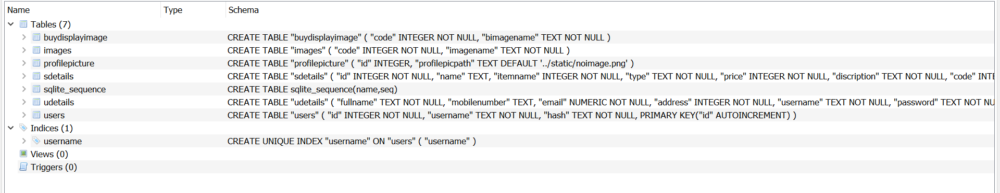
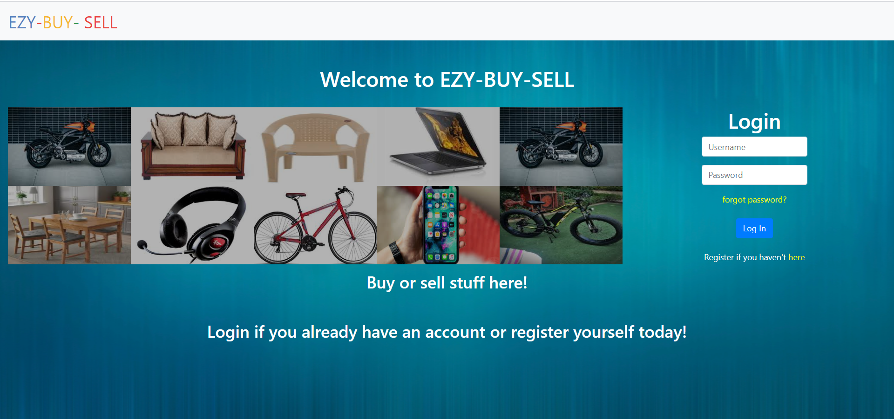
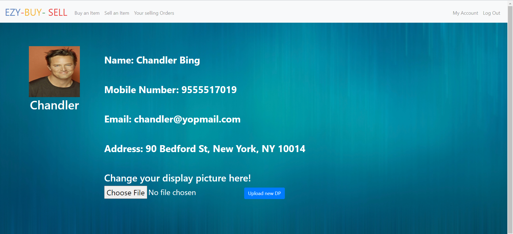
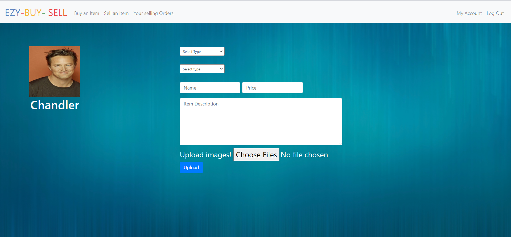

# EZY-BUY-SELL

## Welcome to Archit's CS50 Final Project - EZY-BUY-SELL

### See the video - [link to the video](https://www.youtube.com/watch?v=VRULNpoLS80)

## Languages used in making:
1. Python(Flask)
2. SQL
3. HTML
4. CSS (both simple & bootstrap)
5. JavaScript & little of JQuery
 
IDE used- PyCharm

## Database
Image of database
 

 
software used to manage database- DB Browser (SQLite)
 
note- Images that get uploaded on the website gets uploaded into the static folder and the path of which is stored in the databse.

## Overview in brief:

The registerd users will be able to add different commodities that they would like to advertise for selling and the users who are interested in buying that commodity
can contact the seller using the seller details provided with the respective commodity.

## All the mails within the site are sent using the Flask-mail
## Overview according to different routes:

## **1. Register**

You can register yourself by clicking the register link, fill all the blanks with the appropriate data, after filling all the data click Register button, after successfull registration you will be recieving an activation mail on the registered email id(**sent using FLask mail**), in that activation mail there would be an activation link you have to click on that link to activate your account otherwise you won't be able to access your account.

## **2. Forgot Password**

Now if in any case you forgot your password then you just have to click the forgot password, then on the following page you have to enter the registered email id, then the an email regarding change your password will be sent to your registered email.

## **3. Login**

After the activation of your account you can login directly using your username and password.

## **4. My Account**

On this all the details you entered are visible and you can also upload your profile picture by choosing file and then clicking the upload button and then DP is being displayed (By default DP is there you can change it if you want).

## **5. Sell an Item**

You can advertise the item you want to sell you just have to select the category of the item (e.g. if you want to sell a table you would be selecting "**Furniture**" from the first dtopdown list and "**Table**" from the second dropdown list), after this you will have to give a name to that item which suits that item, further you have to set the price on which you would like to sell the item, next is the discription - add the appropriate discription for your product, then you have to upload atleast one photograph of the item(you can select as many as you want! all the files you upload on this website should be in one of these formats- .jpg, .jpeg, .png" otherwise it won't get uploaded).
 
 
note: the first picture you select will be displayed as the display picture for your item so choose wisely.

## **6. Buy an Item**

You can see different items on sale when you visit this page.
 
 
When you vist this page it shows all the products it has for sale but you can specify what do you want to see using the two dropdown lists (select lists) to specify in what items are you intrested.
 
 
(e.g. if you want to see a chair then you would be selecting "**Furniture**" from the first dropdown list and "**Chair**" from the second dropdown list then it would display all the items matching your specifications).
 
 
You can also see the images of the product just by hovering over the small image icons under the heading images.
 
 
Now if you are really intrested in some of the product which is on sale, then you can see the seller details by clicking on the down arrow in the buy table under the heading "**seller**", when the arrow is clicked it would extend the table and you can clearly see the seller details and then you can contact them for buying or negotiating, etc. with their item.

## **7. Your Selling Orders**

If you want to see the selling orders you have put on the website you can click on the your selling orders tab and it will display you your selling orders.
 
 
If you want to change something with your order like : if you don't want to sell it any more or if it has already been sold then in these cases you can delete your orders just by adding the code number displayed on the page it self inside the table under the heading "**code**".
 
 
If you want to edit your order you can do this again by entering the code into the field and then while editing you just have to enter only those fields which you want to change and click "**submit**".
